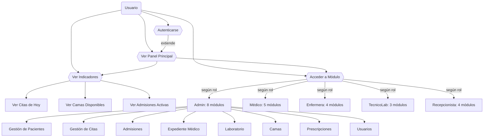
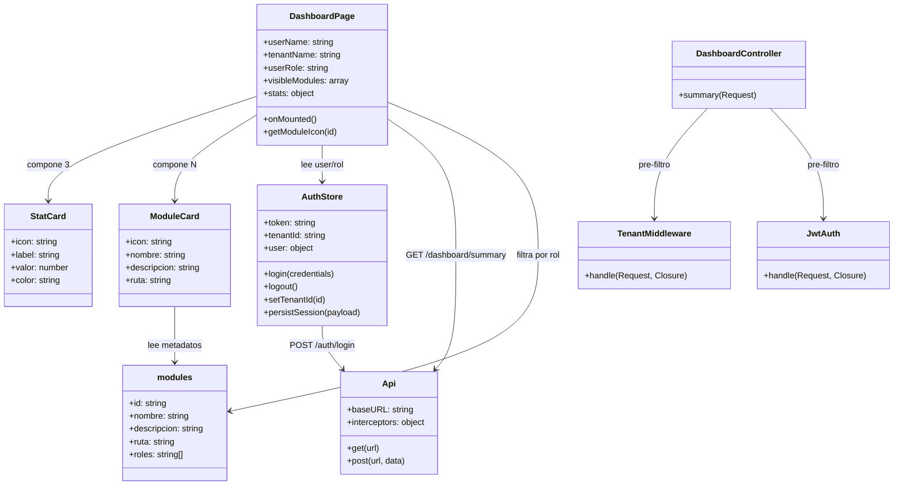
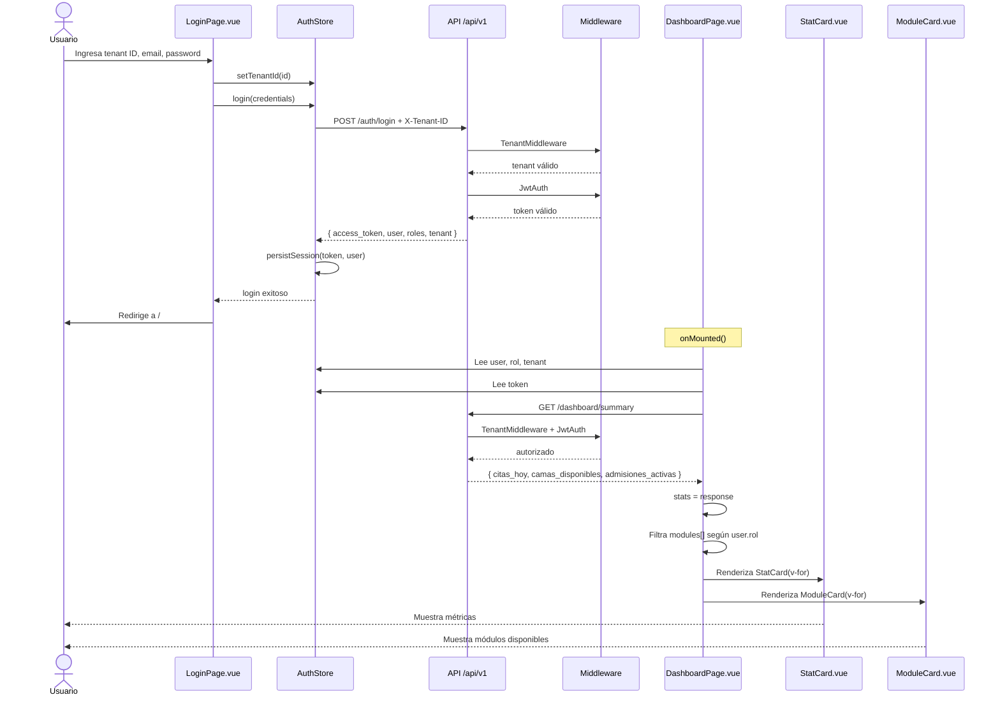
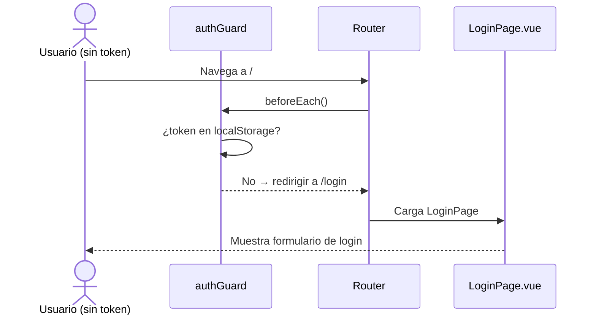
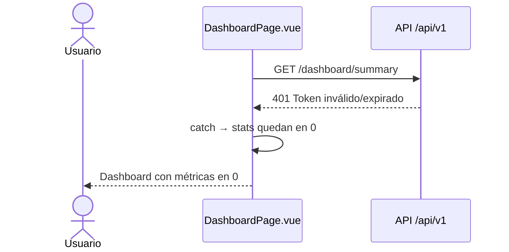

# Diagramas UML — Panel Principal

---

## 1. Diagrama de Casos de Uso

**Actores:** Usuario (hereda según su rol: Admin, Médico, Enfermera, TecnicoLab, Recepcionista)

**Casos de uso resumen:**

| ID | Nombre | Actor principal |
|---|---|---|
| UC1 | Ver Panel Principal | Todos (autenticados) |
| UC2 | Autenticarse | Todos (pre-condición) |
| UC3 | Ver Indicadores | Todos |
| UC4 | Acceder a Módulo | Todos (filtrado por rol) |

---

## 2. Diagrama de Clases

**Paquetes / capas:**

| Capa | Componentes |
|---|---|
| **Presentación (Vue)** | `DashboardPage`, `StatCard`, `ModuleCard` |
| **Estado (Pinia)** | `AuthStore` |
| **Comunicación** | `Api` (Axios) |
| **Config** | `modules` (data estática) |
| **Backend (Laravel)** | `DashboardController`, `TenantMiddleware`, `JwtAuth` |

---

## 3. Diagrama de Secuencia

### Flujo completo: Login → Dashboard

### Flujo alternativo: Sin sesión

### Flujo alternativo: Token inválido

